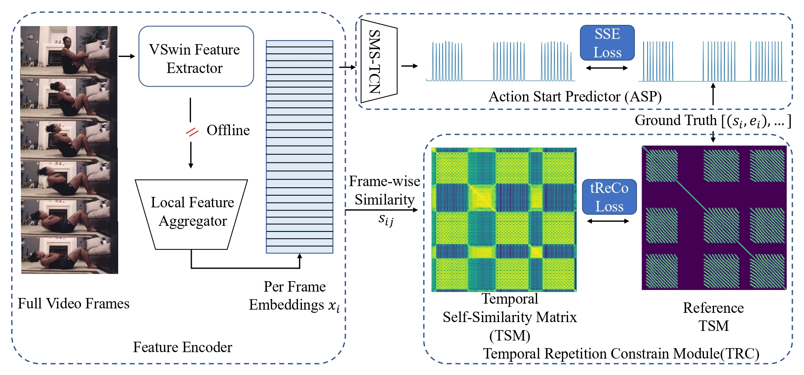

#  RACnet [ICIP 2024]

[Yanan Luo*](https://scholar.google.com/citations?user=yuDQY0YAAAAJ&hl=en),
[Jinhui Yi*](https://scholar.google.com/citations?user=kLZxzzUAAAAJ&hl=en),
[Yazan Abu Farha](https://scholar.google.com/citations?user=fSdpG-0AAAAJ&hl=en),
[Moritz Wolter](https://scholar.google.de/citations?user=OLvO62sAAAAJ&hl=de),
[Juergen Gall](https://pages.iai.uni-bonn.de/gall_juergen/)

*Equal Contribution

If you like our project, please give us a star✨ on Github for latest update.

## Rethinking temporal self-similarity for repetitive action counting (ICIP2024)
This is the official implementation for paper ["Rethinking temporal self-similarity for repetitive action counting"](https://arxiv.org/abs/2407.09431)

## 🚀 News
- 2025-03-10: The `*_feature_npz` folders are released. The test script directly on videos is released.
- 2024-11-14: The **`Oral`** video has released on youtube channel. [[video](https://youtu.be/idCc8tE0pEo)]
- 2024-09-25: The code and pre-trained model are avaliable. [[pretrained](https://drive.google.com/file/d/1cmWsc7vomugrh3idvHOrkQTbujrAMZPE/view?usp=sharing)]
- 2024-08-09: This paper has been accepted by **`WICV workshop 2024`** in **`ECCV 2024`** as an extended abstract.
- 2024-07-12: The preprint of the paper is available [[paper](https://arxiv.org/abs/2407.09431)].
- 2024-06-07: This paper has been accepted by **`ICIP 2024`** as **`Oral`**.

## 💡 Introduction
We rethink how a temporal self-similarity matrix (TSM) can be utilized for counting repetitive actions and propose a framework (RACnet) that learns embeddings and **predicts action start probabilities at full temporal resolution**. The number of repeated actions is then inferred from the action start probabilities. We propose a novel loss based on a **generated reference TSM**, which enforces that the self-similarity of the learned frame-wise embeddings is consistent with the self-similarity of repeated actions. 



### 🔍 Main results on three datasets
| Datasets  |  MAE⬇️  |  OBO⬆️  |
| ----------|--------| -------| 
| RepCountA | 0.4441 | 0.3933 |
| UCFRep    | 0.5260 | 0.3714 |
| Countix   | 0.5278 | 0.3924 |

## Getting started
### 🔧 Data preparation

We provide the `*_feature_npz` folders (without annotation files), please check in [RACnet_feature_npy](https://huggingface.co/datasets/luoadore/RACnet_feature_npy). In this case, you can directly skip into step 5 and start training, testing:)

1. Download pretrained backbone model: [Video Swin Transformer tiny](https://github.com/SwinTransformer/Video-Swin-Transformer)([github](https://github.com/SwinTransformer/storage/releases/download/v1.0.4/swin_tiny_patch244_window877_kinetics400_1k.pth)).
2. Feature extractor: extract and flatten the feature map as *7 X 7 X 768* with the backbone model.
3. Generate the reference TSM.
  ```
    cd dataset
    python gen_refTSM.py
  ```
4. Save several arrays into a final file in compressed .npz for each video data.
  ```
    # The arrays to be included in the file:
    #    per_frame_features: from step 2
    #    refTSM: from step 3
    #    frame_length: see metadata/RepCountA_frame_length.csv
    #    frame_name: same as above

    import numpy as np
    # RepCountA
    np.savez(file='video_name.npz', img_feature=per_frame_features, gt_tsm=refTSM, length=frame_length)
    # UCFRep and Countix, inference only
    np.savez(file='video_name.npz', img_feature=per_frame_features, length=frame_length, count=count)
  ```
5. Data structure.
  ```
    # RepCountA dataset
    # .csv files are the annotations from the original dataset
    RepCountA_feature_npz/
    ├── train.csv
    ├── valid.csv
    ├── test.csv
    ├── train/
    │   ├── video_1.npz
    │   ├── video_2.npz
    │   └── ...
    ├── valid/
    │   ├── video_4.npz
    │   ├── video_5.npz
    │   └── ...
    └── test/
        ├── video_7.npz
        ├── video_8.npz
        └── ...
    
    # UCFRep and Countix dataset
    *_feature_npz/
    ├── test.csv
    └── test/
        ├── video_7.npz
        ├── video_8.npz
        └── ...
  ```
Note:
1. We will upload the `*_feature_npz` folders soon.
2. Countix is a subset of Kinetics. Some videos are not avaliable at test time any more, we provide the features of avalible videos in `Countix_feature_npz`.

### 🔧 Enviroment
Recommend to use conda virtual env.
```
  conda create -n racnet python=3.11.5 -y
  conda activate racnet 
  pip install -r requirements.txt # you may need to change the cuda version based on your machine
```
### 🗝️ Train and test
Please refer to the configs for train and test seperately.
```
  python train.py configs/train_RACnet.py
  python test.py configs/test_RACnet.py
```

##  Citing RACnet
```
  @inproceedings{luo2024rethinking,
  title={Rethinking temporal self-similarity for repetitive action counting},
  author={Luo, Yanan and Yi, Jinhui and Farha, Yazan Abu and Wolter, Moritz and Gall, Juergen},
  booktitle={2024 IEEE International Conference on Image Processing (ICIP)},
  pages={2187--2193},
  year={2024},
  organization={IEEE}
}
```

## 🔒 License
This project is licensed under the Creative Commons Attribution-NonCommercial 4.0 International License. You can view the full license [here](LICENSE).
